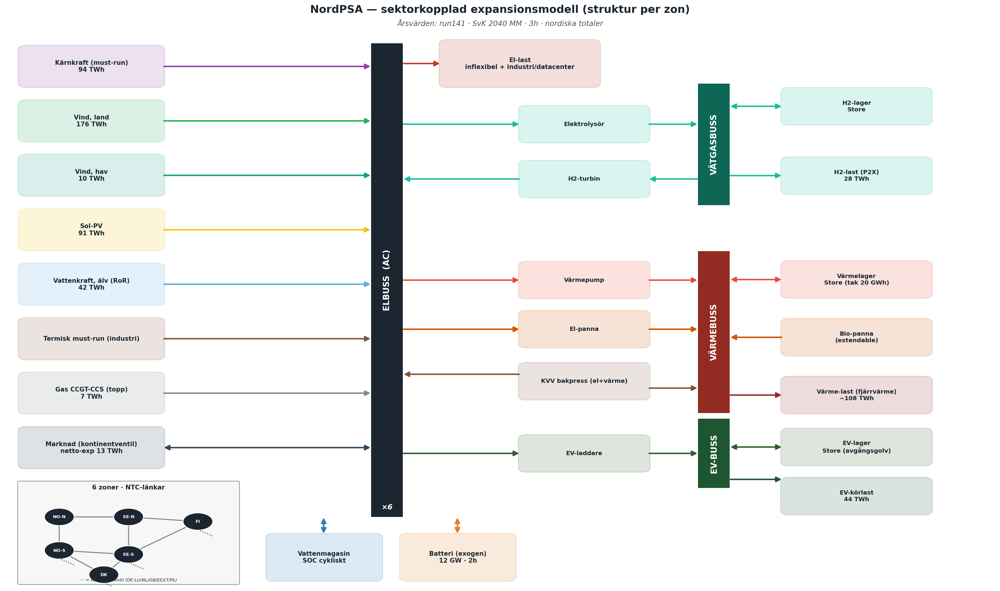

# NordPSA

A power system model of the Nordic countries built on [PyPSA](https://pypsa.org). Six
aggregated bidding-zone groups — SE-N, SE-S, NO-N, NO-S, DK, FI — linked by
NTC transfer capacities and to the continent through price-setting
cables. The model combines **capacity expansion** (what should be built for 2040) with
**dispatch** (how the resulting system runs, hour by hour, and what prices it produces),
using 2023–2025 weather, inflow and load as the three reference years.



## What it models

- **Hydropower in detail**: reservoirs with measured inflow (NVE, ENTSO-E), run-of-river
  split out as must-run, operating restrictions (hourly/daily floors, weekly caps), and a
  bid ladder that represents the spread of water values across the aggregated fleet.
- **Water values from limited foresight**: dispatch runs as a rolling horizon with a
  terminal water-value curve fitted to measured reservoir paths and price elasticities,
  not to the prices the model is meant to predict.
- **2040 system**: demand, costs and grid from Svenska Kraftnät's long-term market
  analysis (LMA26), new nuclear with synthetic stochastic availability, onshore and
  offshore wind, solar, batteries, gas peakers.
- **Sector coupling**: district heating (heat pumps, electric boilers, CHP, heat storage),
  hydrogen (three flexibility categories), electric vehicles and industrial demand response.
- **Today's system**: the same model run against today's fleet, load and grid, for
  validation against observed prices and production.

## Installation

```bash
conda env create -f environment.yml
conda activate nordpsa-env
pip install -e .
```

The solver is [HiGHS](https://highs.dev) (installed with the environment).

## Data

Input data is fetched from public sources and built into `data/processed/`; neither raw
nor processed data is part of the repository.

```bash
make fetch            # eSett: load and production per zone
make fetch-ec         # Energy Charts: VRE profiles and continental prices
make fetch-nve        # NVE/ENTSO-E: hydro inflow and run-of-river
make fetch-ninja      # Renewables.ninja: offshore wind profiles
make fetch-openmeteo  # Open-Meteo: temperatures for heat demand
python scripts/synth_se_ror.py   # synthetic Swedish run-of-river (SvK reports none)
make build            # build data/processed/
make build-heat       # district-heating load profiles
```

Some sources need a free API key in the environment: `ENTSOE_API_TOKEN`
([ENTSO-E Transparency](https://transparency.entsoe.eu)) and `NINJA_TOKEN`
([Renewables.ninja](https://www.renewables.ninja)).

## Running

Three commands, one per kind of run:

```bash
nordpsa expand   --output run001_baseline                     # 2040 expansion: capacities optimized
nordpsa dispatch --from run001_baseline --output run002_disp  # dispatch of that fleet, rolling horizon
nordpsa today    --output run003_today                        # today's system
```

Settings are layered — `config/defaults.yaml` ← `config/worlds/<world>.yaml` ←
`--experiment FILE` ← `--set KEY=VALUE` — and every default lives in exactly one place:

```bash
nordpsa expand --experiment lowhydro06 --output run004_dry         # config/experiments/lowhydro06.yaml
nordpsa expand --set market.ntc_scale=0.5 --output run005_market50
nordpsa expand --print-config                                      # show resolved settings, run nothing
nordpsa expand --year 2024 --resolution 3 --dry-run                # build the network only
```

Each run writes `results/<output>/`: the solved network (`network.nc`), CSV time series
(prices, dispatch, flows, reservoir levels, water values), `run_config.yaml` with the
fully resolved settings, and `run_meta.txt`. A dispatch inherits its source run's world
from that file, so scenario settings never have to be repeated.

A full three-year expansion at 2h resolution takes several hours and ~6 GB of RAM; a
single year at 3h runs in minutes.

## Repository layout

```
nordpsa/            the model
  cli.py settings.py run.py   commands, layered settings, the run pipeline
  world.py modes.py solve.py  scenarios, expansion vs dispatch, solving
  network/          PyPSA network, one module per component type
  constraints/      custom LP constraints (SOC anchor, terminal value, bid ladder, hydro operation)
  profiles/         inflow, nuclear availability, heat load
  data/             clients for eSett, Energy Charts, ENTSO-E, Renewables.ninja
  wv/               terminal water-value curve
config/             zones.yaml (model data), defaults.yaml, worlds/, experiments/, terminal_curves/
scripts/            data fetching and building, batch runs, NTC calibration
```

`CLAUDE.md` documents the design decisions and the measurements behind them. Code
comments and several config notes are in Swedish.

## Data sources and licences

| source | used for | terms |
|---|---|---|
| [eSett Open Data](https://opendata.esett.com) | load and production per zone | eSett terms of use |
| [Energy Charts](https://energy-charts.info) (Fraunhofer ISE) | VRE profiles, prices, reservoir levels | CC BY 4.0 |
| [ENTSO-E Transparency Platform](https://transparency.entsoe.eu) | inflow, run-of-river, prices, exchanges | ENTSO-E terms of use |
| [NVE](https://www.nve.no) | Norwegian inflow | NLOD |
| [Renewables.ninja](https://www.renewables.ninja) | offshore wind profiles | CC BY-NC 4.0 |
| [Open-Meteo](https://open-meteo.com) | temperatures | CC BY 4.0 |
| [When2Heat](https://doi.org/10.25832/when2heat) | heat demand method and parameters (`data/when2heat/`) | CC BY 4.0 |

`data/when2heat/` contains parameters from the When2Heat dataset: Ruhnau, O., Hirth, L.
& Praktiknjo, A. (2019). *Time series of heat demand and heat pump efficiency for energy
system modeling.* Scientific Data 6, 189. https://doi.org/10.1038/s41597-019-0199-y

Scenario assumptions for 2040 follow Svenska Kraftnät, *Långsiktig marknadsanalys 2026* (LMA26), "Mixat Medel" scenario.

## Licence

MIT — see [LICENSE](LICENSE). The licence covers the code; fetched data remains under the
terms of its source.
